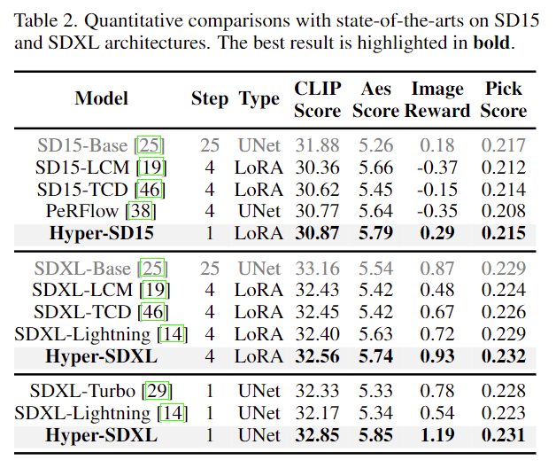
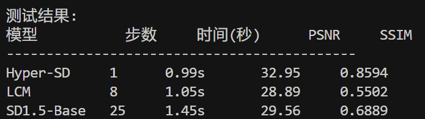
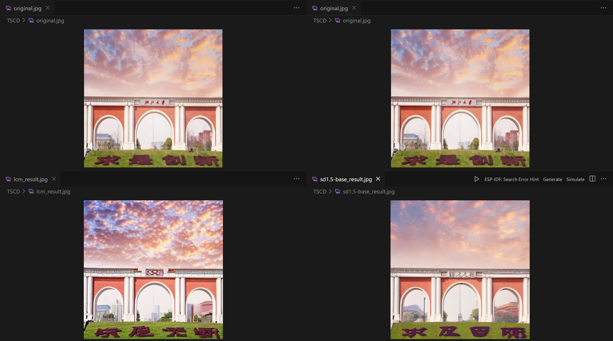

## TSCD

- 在该复现实验中，根据论文中Table2的表格选择比较对象

  - 其中SDXL无法在RTX4060本地计算机上运行，因此对比SD1.5，选取的是Hyper-SD、SD15-LCM、SD1.5-Base,对应特点如下
  
| 模型          | 特点                                                                                     | 效果                                                                                     |
|:---:|:---:|:---:|
| Hyper-SD      | 采用TSCD（轨迹分段一致性蒸馏）技术支持1-8步推理 结合人类反馈学习和分数蒸馏优化 | 1步生成，速度快，质量高 |
| SD15-LCM      | 基于Latent Consistency Models 典型步数4-8步 平衡速度与质量                     | 4步生成，速度快，质量低 需要提示词调优 |
| SD1.5-Base    | 原生Stable Diffusion 1.5模型 标准25-50步推理 无加速优化                        | 生成质量高 速度慢 完整支持所有SD功能 |

- 实验结果如下：

